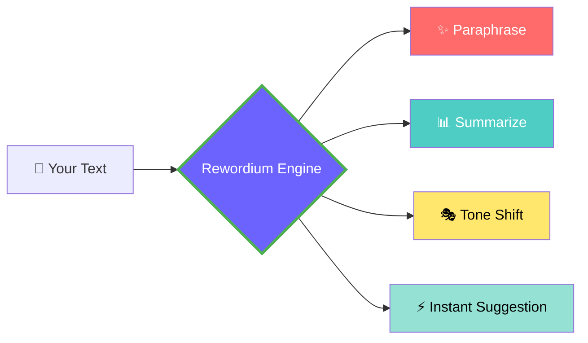

# ✨ Rewordium — AI Writing Assistant & Keyboard

<p align="center">
  
</p>

<div align="center">

<a href="https://github.com/Chethan616/Rewordium/releases/latest">
  
</a>


<a href="https://github.com/Chethan616/Rewordium/releases">
  
</a>

---

**Rewordium** is a next-generation **AI writing assistant & keyboard** for Android.  
Rewrite, summarize, refine, and write anywhere — *privately, beautifully, intelligently.*

[🌊 Features](#-features) • [📥 Installation](#-installation) • [🧠 AI Tools](#-ai-tools) • [🏗️ Building](#-building-from-source) • [🎨 Visuals](#-visual-experience) • [🛠️ Tech Stack](#-tech-stack) • [🤝 Contributing](#-contributing)

</div>

---

## About

Rewordium combines the power of **AI writing tools**, a **smart keyboard**, and a **floating rewrite assistant** — all built with **privacy at its core**.  
It’s designed for creators, professionals, and anyone who values effortless, intelligent writing.

> “Like the Axolotl, Rewordium regenerates — your creativity, your words, your ideas.”

---

## ✨ Features

### 🧠 AI Writing Tools
- ✍️ Rewrite, summarize, and refine text instantly  
- 🎭 Adjust tone — formal, creative, or concise  
- 💬 Works across any app via the floating AI bubble  
- ⚡ Lightning-fast response with privacy-first AI  

### 🎹 Intelligent Keyboard
- 🚀 Five-tier **Turbo Delete** acceleration  
- 🎧 Premium haptics and smooth key transitions  
- 💡 Smart clipboard integration  
- 🌗 Adaptive theme and animation transitions  

### 🔒 Privacy & Security
- No tracking, no ads, no data collection  
- Local-first text processing  
- Transparent permission and privacy controls  

### 🎨 Design & Customization
- Light/dark green gradient themes  
- Adjustable keyboard height and spacing  
- Fluid, minimal interface with responsive design  

---

## 🦎 Latest Release — *v1.0.10 “Axolotl”*

> *Regeneration through refinement.*

- ✅ Turbo Delete 2.0 — smoother acceleration  
- ✅ Fixed overflow in experimental dialog  
- ✅ Refined popup animations  
- ✅ Improved haptics and transitions  

📄 [Full Changelog →](playstore_releases/RELEASE_NOTES_AXOLOTL.md)

---

## 📥 Installation

### From GitHub
1. Visit [**Releases**](https://github.com/Chethan616/Rewordium/releases)  
2. Download the latest build (for example, `v1.0.10-Axolotl.apk`)  
3. Transfer it to your Android device or download directly  
4. Install it (you may need to allow *Install from Unknown Sources*)  
5. Enable Rewordium in  
   `Settings → System → Languages & input → On-screen keyboard`  
6. Open the app to customize theme, keyboard height, haptics, and preferences  

---

### From Google Play
<a href="https://play.google.com/store/apps/details?id=com.noxquill.rewordium" style="text-decoration:none">
  
</a>  

**Package name:** `com.noxquill.rewordium`

---

## 🧠 AI Tools

| Tool | Description |
|------|-------------|
| ✍️ **Rewrite** | Reword sentences naturally with AI |
| 🧾 **Summarize** | Condense long text into concise ideas |
| 🎭 **Tone Shift** | Instantly switch tone between creative, formal, or casual |
| 🪶 **Grammar Fix** | Correct grammar, punctuation, and flow |
| 💬 **Ask AI** | Get rewriting help anywhere, inside any app |

---

## 🧩 AI Engine Flow


---
## 🏗️ Building From Source

You can easily build Rewordium from source using Flutter:

```bash
git clone https://github.com/Chethan616/Rewordium.git
cd Rewordium
flutter pub get
flutter run
flutter build apk --release
