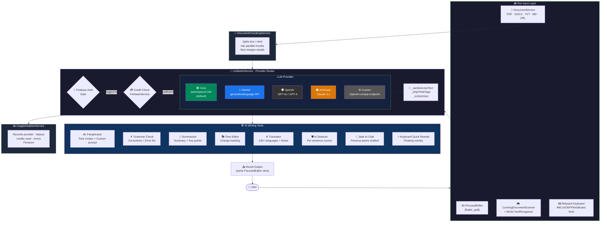

# 🐼 Rewordium — The AI-Powered Writing Assistant & Keyboard

<p align="center">
  
</p>

<div align="center">

<a href="https://github.com/Chethan616/Rewordium/releases/latest">
  
</a>


---

**Rewordium** is an advanced, high-performance **AI writing assistant & smart keyboard** built for Android and iOS.  
Refine, translate, summarize, and adapt your tone instantly across any application — *privately, seamlessly, and securely.*

[🌊 Features](#-features) • [📥 Installation](#-installation) • [🧠 AI Tools](#-ai-tools) • [🏗️ Building](#-building-from-source) • [🧩 Architecture](#-ai-engine-flow) • [🤝 Contributing](#-contributing)

</div>

---

## About

Rewordium merges the utility of a modern, tactile soft keyboard with the capabilities of state-of-the-art Large Language Models. Featuring a floating assistant bubble, unified sticker utility, and local privacy-first sandboxing, it is built to protect user confidentiality while enhancing productivity.

> “Like the Panda, Rewordium is composed, focused, and balanced — quietly processing language with power and poise.”

---

## ✨ Features

### 🧠 AI Writing Suite
- ✍️ **Natural Paraphraser:** Rephrase sentences to improve clarity, vocabulary, or length.
- 🎭 **Multi-Tone Adaptability:** Instantly adjust prose to formal, casual, concise, or creative tones.
- 🪶 **Grammar Optimization:** Identify structural errors, grammar issues, and improve flow.
- 💬 **Context-Aware Assistance:** A persistent assistant floating panel that works natively over any text input field.

### 🎹 Intelligent Input Engine
- 🚀 **Turbo Delete:** A smooth 5-tier progressive acceleration system for efficient, natural backspacing.
- 🖼️ **Sticker Studio & GIF Panel:** Fully unified clipboard, sticker, and animated GIF panels featuring tag filtering.
- 🎧 **Tactile Haptics:** Custom low-latency haptics designed to mimic high-end hardware keyboards.
- 🌗 **Adaptive Themes:** Fluid light/dark color transitions matching the host OS theme settings.

### 🔒 Privacy & Sandboxing
- Local-first text routing for maximum confidentiality.
- Strict security controls ensuring zero diagnostic reporting, telemetry, or user tracking.
- Compliant sandbox routing for all inputs, secrets, and clipboard logs.

---

## 🐼 Latest Release — *v1.0.28 “Panda”*

- 🎨 **Material 3 Redesign:** Upgraded Tools Floating Action Button into a modern fan-out menu.
- 🖼️ **Sticker Studio Integration:** Support for animated GIFs, custom sticker packs, and search tag filters.
- 🍏 **iOS Engine Upgrades:** Full compatibility with Swift 6 and KeyboardKit v10, centered modifier layouts, and Apple HIG styling.
- 🧹 **Stabilization:** Resolved `CropImageView` looping issues, bypassed deep-link startup recreation loops, and cached picked URIs safely.

📄 [Full Changelog →](playstore_releases/RELEASE_NOTES_PANDA.md)

---

## 📥 Installation

### Android (APK)
1. Navigate to [**Releases**](https://github.com/Chethan616/Rewordium/releases) and download the latest `v1.0.28-Panda.apk`.
2. Allow installation from unknown sources if prompted.
3. Enable the keyboard layout via:
   `Settings → System → Languages & input → On-screen keyboard → Manage keyboards`

---

### Google Play Store
<a href="https://play.google.com/store/apps/details?id=com.noxquill.rewordium" style="text-decoration:none">
  
</a>  

**Package Name:** `com.noxquill.rewordium`

---

## 🧠 AI Tools

| Tool | Description |
|------|-------------|
| ✍️ **Rewrite** | Reformulate text naturally to improve readability. |
| 🧾 **Summarize** | Condense lengthy articles or notes into clean bulleted summaries. |
| 🎭 **Tone Shift** | Transition text tone between formal, creative, or casual. |
| 🪶 **Grammar Fix** | Automatically detect and fix syntax errors. |
| 💬 **Ask AI** | Interact directly with the language engine inside any app. |

---

## 🧩 AI Engine Flow

The pipeline below outlines how user text is captured, authorized, routed through LLMs, sanitized, and returned back to the editor view:


```mermaid
flowchart TD
    U([👤 User]) --> INPUT

    subgraph INPUT["📥 Text Input Layer"]
        direction TB
        EDITOR["✍️ FocusedEditor\n(flutter_quill)"]
        IMPORT["📂 DocumentService\nPDF · DOCX · TXT · MD · URL"]
        SCAN["📷 CunningDocumentScanner\n+ MLKit TextRecognizer"]
        KB["⌨️ Reboard Keyboard\nIME (AOSP/FlorisBoard fork)"]
    end

    INPUT --> ENGINE

    subgraph ENGINE["🔀 UnifiedAIService · Provider Router"]
        direction LR
        GATE{"🔐 Firebase Auth\nGate"}
        GATE -->|logged in| CRED{"💳 Credit Check\nFirebaseService"}
        CRED -->|sufficient| PROVIDER

        subgraph PROVIDER["LLM Provider"]
            GROQ["🟢 Groq\nqwen/qwen3-32b\n(default)"]
            GEMINI["🔵 Gemini\ngenerativelanguage API"]
            OAI["⚫ OpenAI\nGPT-4o / GPT-4"]
            CLAUDE["🟠 Anthropic\nClaude 3.x"]
            CUSTOM["⚙️ Custom\nOpenAI-compat endpoint"]
        end

        PROVIDER --> SANITIZE["🧹 _sanitizeUserText\n_stripThinkTags\n_extractJson"]
    end

    subgraph TOOLS["🛠 AI Writing Tools"]
        direction TB
        PARA["✍️ Paraphraser\nTone modes + Custom prompt"]
        GRAM["🪶 Grammar Check\nCorrections + Error list"]
        SUMM["🧾 Summarizer\nSummary + Key points"]
        TONE["🎭 Tone Editor\nChange tracking"]
        TRANS["🌐 Translator\n100+ languages + Notes"]
        DETECT["🛡️ AI Detector\nPer-sentence scores"]
        JADE["💬 Jade AI Chat\nPersona-aware chatbot"]
        KB_AI["⚡ Keyboard Quick Rewrite\nFloating overlay"]
    end

    ENGINE --> TOOLS
    TOOLS --> OUT["📤 Result Output\n(same FocusedEditor view)"]
    OUT --> U

    subgraph CHUNKING["📄 DocumentChunkingService"]
        CHK["Splits text > limit\ninto parallel chunks\nthen merges results"]
    end

    IMPORT --> CHUNKING
    CHUNKING --> ENGINE

    subgraph ANALYTICS["📊 UsageAnalyticsService"]
        ANA["Records provider · feature\ncredits used · errors\nFirestore"]
    end

    ENGINE --> ANALYTICS

    style ENGINE fill:#1a1a2e,stroke:#6C63FF,color:#fff
    style PROVIDER fill:#16213e,stroke:#4CAF50,color:#fff
    style GROQ fill:#00875A,color:#fff
    style GEMINI fill:#1A73E8,color:#fff
    style OAI fill:#333,color:#fff
    style CLAUDE fill:#D97706,color:#fff
    style CUSTOM fill:#555,color:#fff
    style TOOLS fill:#0f3460,stroke:#e94560,color:#fff
    style INPUT fill:#1a1a2e,stroke:#32CD32,color:#fff
    style CHUNKING fill:#1e293b,stroke:#64748b,color:#fff
    style ANALYTICS fill:#1e293b,stroke:#64748b,color:#fff
```

### Key Architecture Notes

- **Default LLM Provider:** Utilizes `qwen/qwen3-32b` via Groq Cloud by default.
- **Result Optimization:** Post-processes raw LLM responses using `_stripThinkTags()` and `_extractJson()` to sanitize raw output before rendering.
- **Auth and Quotas:** Integrates with Firestore to manage request routing, active user sessions, and credit deductions securely.
- **Large Document Processing:** Uses `DocumentChunkingService` to divide inputs exceeding model contexts, sending sub-requests asynchronously and merging results.

---

## 🏗️ Building From Source

You can build and deploy the application locally using Flutter:

```bash
git clone https://github.com/Chethan616/Rewordium.git
cd Rewordium
flutter pub get
flutter run
flutter build apk --release
```

---

## Attribution & Licensing

This project utilizes custom elements of the open-source **FlorisBoard** input engine. 

- **FlorisBoard Project:** [GitHub Repository](https://github.com/florisboard/florisboard)
- **License Type:** Apache License 2.0
- **Notice & Declarations:** Refer to the [NOTICE](NOTICE) file and in-app credits page for full attribution details.