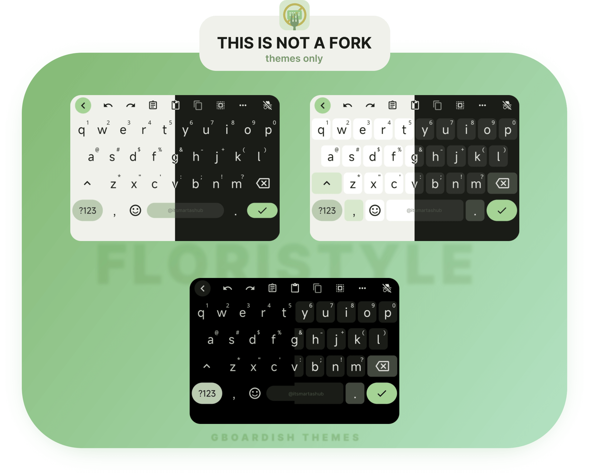
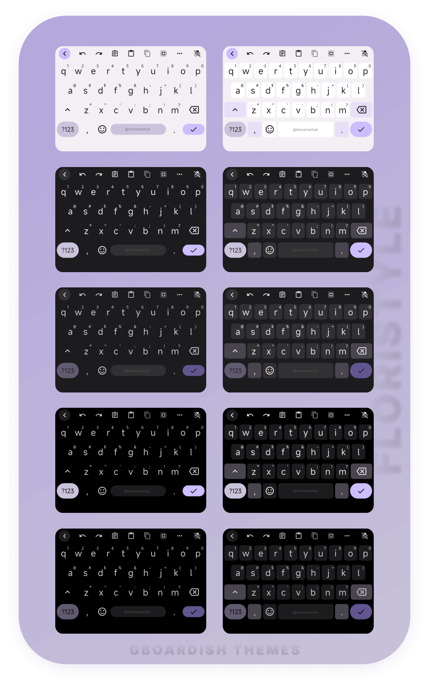

<h1 align="center">FLORISTYLE</h1>
<h2 align="center">Gboardish your Florisboard with Material You themes.</h2>

 

    

      
    

    

        

            <b>MORE SCREENSHOTS</b>
        

&nbsp;

    

 

> [!WARNING]
> For "futofied" themes, the hint keys are intentionally transparent (they may look invisible even when enabled). This is a clean, personal preference.
> If needed, you can make them visible by changing the `foreground` value for `key-hint` element in the theme options

## Compatibility

Floristyle themes are specifically designed to be compatible with different versions of Florisboard. Please ensure you are using the correct version of Floristyle for your version of Florisboard to avoid any compatibility issues.

## Setup

1.  Open the **Florisboard** app
2.  Click on `🧩 Addons & Extensions`
3.  Click on `Import` ➡️ `Select files`
4.  Select the `flex` file you have downloaded `gboardish-v4.0.0.flex` and later
5.  You should see the preview content of the `flex` file. Press `Import`
6.  Go back to the main page, press `🎨 Theme ` and then select the theme you prefer for `☀️ Day theme ` and `🌙 Night theme `

## Themes (`25`)

- ☀️ **LIGHT** (Border/Borderless)
- 🌙 **DARK** (Border/Borderless)
- 🌑 **AMOLED** (Border/Borderless)

> [!TIP]
> If you feel overwhealmed or bloated with so many floristyle themes, please feel free to delete unused ones by navigating to:
>
> `🧩 Addons & Extensions` > `🎨 Theme extensions` > `Edit` for the `FloriStyle themes` section, then in listed `Bundled themes` press `Delete` for the themes you would like to remove.

## GUIDE: Monochromatic mode

Since the `v0.5.2` FlorisBoard update, there is a noticeable shift in how system colors are processed. For users who prefer a pure monochromatic look, you might notice that some areas now have a blue-ish tint instead of staying neutral grey (specifically secondary-related and surface-related colors. For more you can check out [this PR discussion](https://github.com/florisboard/florisboard/pull/3145)

If you are using FloriStyle and want to restore a strictly greyscale palette, you can manually define the behavior within the theme settings.

### Steps

1. Navigate to `Addons & Extensions` > `Theme extension`
2. Select FloriStyle themes and tap `Edit`
3. Locate your active theme and tap `Edit`
4. Tap `Edit` again in the first section (where the theme title and metadata are)
5. Scroll down to the `"Material You"` heading
6. Under `Palette Style`, manually switch the setting to `Monochrome`

> [!NOTE]
>  Just keep in mind that if you ever want your keyboard to follow a colorful system theme again, you'll need to go back and revert this setting.
> If you know of a more efficient approach or if I've missed a simpler way to handle this, please feel free to share. I'm always looking to refine these steps.

## GUIDE: Change sticky action key

- If you're not using mic for a sticky key, but some other action key, and you still want it to look like Gboard mic, see small guide how to change it in `Steps`.
- For better context, see Florisboard issue [#2330](https://github.com/florisboard/florisboard/issues/2330) where point `2` is

### Steps

- Open the theme you want to edit in theme editor
- Scroll to "**Smartbar Action Key**" where is `code = [-233]` (that's a mic key code)
- Press edit icon ✏️ | `01`
- In "**Target key codes**" press on plus sign ➕ | `02`
- Type in the code key you set for the sticky key. If you don't know which one it is, click on the magnifying glass icon 🔍, which should be flashing now, indicating that you are in 'key recording' mode. Then, press the key whose code you want to find out, for example, incognito | `03`
- When you select the desired key, press "**Add**" | `04`
- You should now have two keycodes. Press `-233` to open a pop-up to remove the mic design | `05`
- Press "**Delete**" | `06`
- Press "**Apply**" to apply design to your selected sticky key | `07`

&nbsp;&nbsp;&nbsp;&nbsp;

## Credits

[Florisboard](https://github.com/florisboard/florisboard), a powerful and feature-rich open-source Android keyboard, is developed and maintained by the talented [@patrickgold](https://github.com/patrickgold) with the invaluable support of an incredible team of [contributors](https://github.com/florisboard/florisboard/graphs/contributors). I’m truly grateful for their hard work and the time they’ve invested in this project.  

Special thanks to [@1fexd](https://github.com/1fexd) for implementing the **Material You** feature into **Florisboard Theme Editor**, which brings dynamic themes to life. And once again, much appreciation to [@patrickgold](https://github.com/patrickgold) for the **Florisboard Theme Editor**, a brilliant tool for customizing themes and unlocking creativity.
